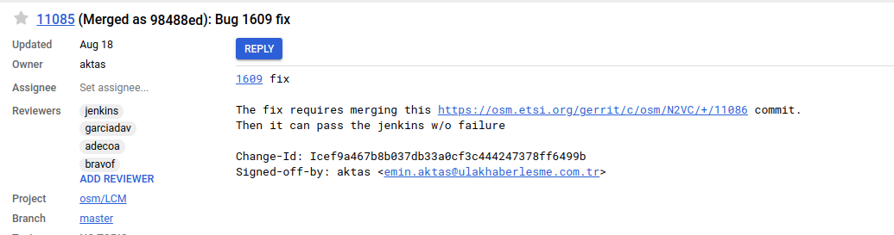

## [OSM Geliştirme - Ana sayfa](../README.md)
# OSM Gerrit ortamında git kullanımı

OSM ortamında diğer Github ve Gitlab'dan farklı olarak master branch üzerinden çalışılmaktadır. Kendi bilgisayarında kod geliştirme yapılırken modülün indirilmesi, lokal branch açma, kodu commit etme, kodun master branch'e gönderilmesi (push) ve gönderilen commit'in güncellenmesi adımları bu sayfada bahsedilmektedir.

## OSM Modül inidirilmesi

Geliştirme yapılacak OSM modülün indirilmesi için bu [bağlantıdan](https://osm.etsi.org/gerrit/admin/projects) erişerek istediğin bir modüle tıkladıktan sonra açılan ekranda 

`Clone with commit-msg hook` altında yazan bağlantı koplayanarak istenilen modül indirilir. Bu kullanılması gereken alanın görülmesi için mutlaka üyelik girişi yapılması gerekmektedir.

Yukarıdaki işlemler tamamlandıktan sonra başarılı bir şekilde yeni commit yapmaya hazır olarak modül inidirildi.


## Lokal branch oluşturma

Geliştirmeye başlamadan önce lokal olarak branch oluşturulması önemlidir. Geliştime sırasında karışıklığın önüne geçer ve kod gelişimini kolaylaştırır.

Yeni indirdiğimiz modulde sadece tek bir branch gereceksiniz `git branch`


Bu branch artık sizin lokalinizde yer almaktadır ve direk olarak OSM repositorisinde bulunan kodun kendisidir. Bu kod üzerinde herhangi değişiklik olması durumunda bunu tespit etmek ve değişiklikleri birleştirmek için aşağıdaki adımlar uygulanmalıdır. 
```bash
# Öncelikle uzak repositoryden yapılan değişikliklerin bilgileri toplanır.
$ git fetch
# Ardından bu değişikler direk olarak master repositorysine merge olması sağlanır.
$ git pull
```
Bu adım yeni bir geliştirmeye başlanmadan önce mutlaka uygulanmalıdır. Aksi halde güncel olamayan kod iler güncellemeye başlayabilir ve bunun sonucunda birleştirme çatışmasına (merge conflict) sebep olabilirsin.

Lokal branch oluşturmak için `git chechout -b yerel-dal` komutu modül içerisinde çalıştırdığında bize yeni bir branch oluşturacaktır.


Bu şekilde lokalinde bulunan branch üzerinden yeni bir branch oluşturulması gerçekleştirildi. Fakat direk olarak uzak repositoryi baz alarak yeni branch oluşturmasıda gerçekleştirilebilir.
```bash
git checkout origin/master -b uzaktan-yerel-dal
```


Şimdi istediğiniz bir IDE'yi kullanarak bu klasörü açabilir ve geliştirmeye başlayabilirsiniz. Python geliştirme IDE'lerinde en çok tercih edilen VsCode ve PyCharm'dır.

## Commit, Push yapma ve gönderilen Commit'in güncellenmesi

Kod üzerinde herhangi bir değişiklik yaptığınızı varsayalım. Bu değişikliğin senin tarafından imzalanarak commit edilmesi ve ardından master branchine gönderilmesi için aşağıdaki komutlar uygulanması yeterlidir. 
```bash
# Kod üzerinde değiştirdiğin dosyaları görmek için
git status
# Kod üzerinde yaptığın değişikleri görmek için
# Bu şekilde direk olarak repositoryideki kod üzerinden değişikler karşılaştırılır.
git diff origin/master
# Commitlerin arasındaki farkları görmek için
git diff 
```


Yapılan değişiklikler doğrulandıktan sonra commit işleminden önce hangi dosyaların commit edileceğini belirtmemiz gerekiyor.
```bash
git add osm_lcm/ns.py
# Tüm dosyaların commit olabilmesi için aşağıdaki şekilde komut çalıştırılabilir.
# Fakat bu şekilde yapılması sonucunda gönderilmesi istenmeyen dosyalarda araya karışması söz konusudur. Bu yüzden tavsiye edilmemektedir.
git add .
```


Artık yapılan değişiklikler commit edilmeye hazırdır.
```bash
# Önce bir commit oluştururlur.
# -s ile commit imzalanır
# -m ile ilk mesaj verilir
git commit -s -m "Örnek mesaj"
# Ardından detayları eklemek ve commit'i kontrol etmek için komut çalıştırılır
git commit --amend
```


Bu işlemi gerçekleştirme sırasında yaptığımız değişiklerle alakalı bilgileri burada açıklamamız gerekmektedir. Burada mesaj eklenirken ilk satır Gerrit üzerinde başlık kısmını oluştururken araya bir satır boşluk bırakacak şeklinde eklenecek ikinci satır bilgiler açıklama kısmını oluşturmaktadır.
Örneğin: 


İlk satır başlık kısmını oluştururken burada `Bug 1609 fix` yazılması sayesinde `fix` kısmı hariç Bugzilla üzerinde açılan hata raporuna direk olarak link verilmesi sağlanmaktadır. Arından bir satır boşlacak şekilde yazılan mesaj ise detayların bahsedildiği kısmı oluşturmaktadır. Bu commit Gerrit'e gönderildiğinde aşağıdaki gibi görülecektir.



Bu adımlar tamamlandıktan sonra artık kod gönderilmeye hazırdır.
```bash
# Bu şekilde yapılan değişiklikler uzak repodaki master branche gönderilebilir.
git push origin HEAD:refs/for/master
```

Daha sonrasında yapılan commit güncellenmek istenilirse aşağıdaki adımlar gerçekleştirilebilir.

Değişiklik yaptığınız mevcut branch duruyorsa yukarıdaki bahsedilen adımlar aynı şekilde gerçekleştirilebilir. Tek fark olarak `git commit -s -m "Örnek mesaj"` adımı uygulanmaz. 

Eğer değişiklik yapılan branch yerelde bulunmuyorsa bu adımları uygula

```bash
# Öncelikle yerel bir branch oluştur.
git checkout origin/master -b guncelleme
# Ardından cherry-pick yapılır. Böylece commitin olduğu gibi oluşturduğu branche geçer.
git fetch <url> <ref> && git cherry-pick FETCH_HEAD
```

Cherry-Pick komutu için aşağıdaki ekran görüntüsünde görüldüğü gibi önce Gerrit üzerinden bir commit açılır. Download üzerine çıktıktan sonra açılan pop-up ekranından cherry-pick bağlantısı kopyalanır ve komut çalıştırılır. 


Ayrıca, `Checkout` altında belirtilen komutta kullanılabilir. Bu komut geçici bir branch oluşturur. Bu oluşan branchten farklı branche geçiş sağlandığında branch yok olur. Fakat bu branchte değişiklik yaptığında eğer commit edilmediyse commit etmen için sana uyarı verecektir. Bu commitleri kaybetmemek için commit numarasının ilk 7 basamağını kullanarak branch oluşturulabilir.
```bash
git branch <yeni-branch-ismi> <commit-numarasının-ilk-7-hanesi>
```
Commit numarası commit işlemi yapıldıktan sonra çıktıda görülebilir. Ekran görüntüsünde görülen `f81eff6`


Diğer bir yöntem ise `git log` ile görüntülenebilir.


Kod göndermek için farklı olarak `git review` kullanılmaktadır. Bu [bağlantı](https://osm.etsi.org/docs/developer-guide/05-git-review.html) üzerinden rehbere erişebilirsin.

OSM topluluğu tarafından hazırlanan `git` ve `git review` rehberleri:
- https://osm.etsi.org/docs/developer-guide/04-merge-conflicts.html
- https://osm.etsi.org/docs/developer-guide/05-git-review.html
