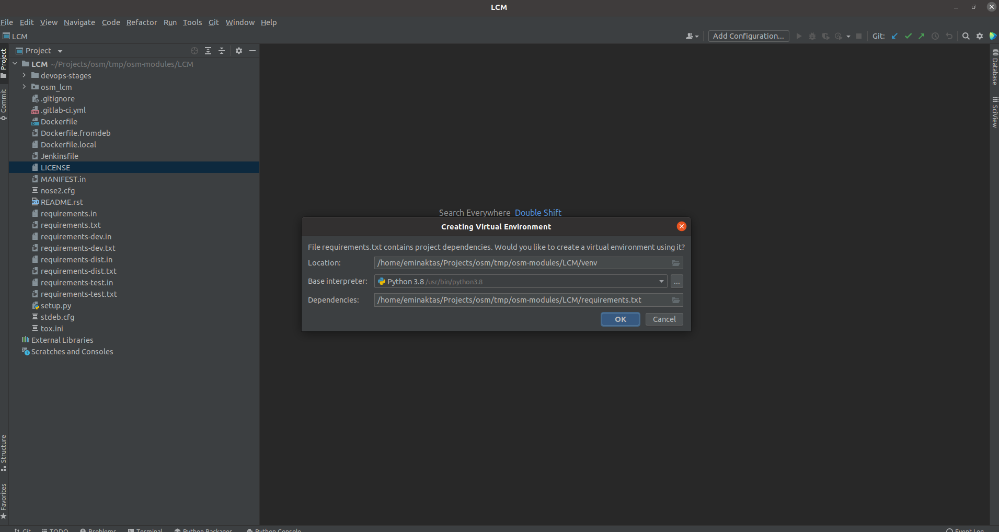
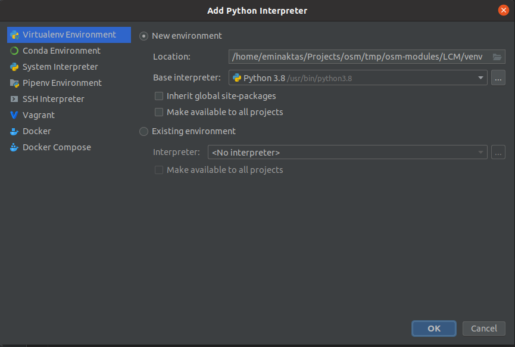
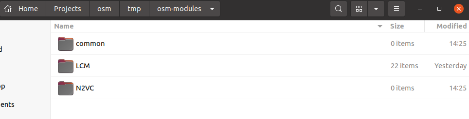
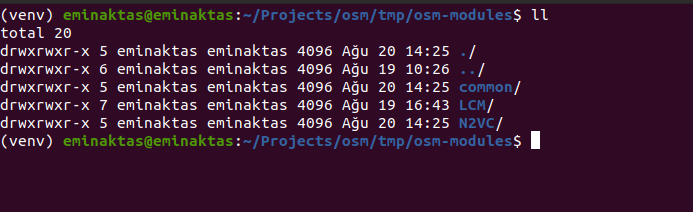
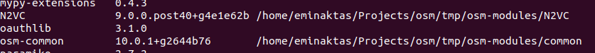

## [OSM Geliştirme - Ana sayfa](../README.md)

# OSM Geliştirme ortamı hazırlanması

OSM ortamında geliştirme çalışmaları yapılabilmesi için kullanılacak modül için Python sanal ortamın hazırlanması (venv) ve Python paketlerin kurulması Pycharm IDE ve IDE bağımsız olarak iki farklı şekilde bütün adımlar bu sayfada bahsedilmektedir.

OSM Python3 versiyonu kullanılmaktadır. Python3.8 kullanılabilir.
```bash
# Python version kontrolü
python3 -V
``` 

## Python sanal ortam oluşturma (venv)

Modül bazlı çalışma gerçekleştirirken her modülün kullandığı paketler ve versiyonları farklıdır. Bu paket versiyonların karışmaması için venv kullanılması karışıklığın önüne geçerek ortamın daha sade olması sağlanır.

### IDE'siz kurulum

```bash
# 1. Yöntem
# Sanal ortal oluşturulması için gerekli paket kurulumu
sudo apt install python3-venv
# Sanal ortamın oluşturulması için gerekli komut
python3 -m venv <hedef-klasör-ismi>
python3 -m venv venv
# 2. Yöntem
# virtualenv apt paketi kurulumu
sudo apt install virtualenv
# Komut sonrasında 
virtualenv <hedef-klasör-ismi> -p/--python <python-exe>
virtualenv venv -p python3
```

Sanal ortam mutlaka modül içerisinde oluşturulmalıdır.

```bash
# Sanal ortamı aktif hale getirmek için gerekli komut
source venv/bin/activate
```

Python, bu oluşturulan sanal ortamda yönetilmektedir. Eğer `which python3` komutunu çalıştırırsanız. Size sanal ortamdaki exe dosyasının dosya yolunun çıktısını vericektir.

### Pycharm IDE ile kurulum

Pycharm ile modül klasöürünü proje olarak açtığınız anda size sanal ortam kurulması için soracaktır. Bununla birlikte `requirements.txt` dosyası aynı klasör içerisinde bulunduğu için paket kurulumlarınında yapılması sağlanabilmektedir. Paket kurulumu için [buraya](#paket-kurulumu) gidin.



Ekran görüntüsünde görüldüğü gibi `OK` tıklanarak ortamın paket kurulumuyla birlikte sağlanır.

Eğer bu sorgu ile karşılaşılmaz ise Pycharm arayüzü üzerinden sağ alt köşeden `<No interpreter>` seçilerek (burada seçili Python interpreter olabilir) ardından `Add Interpreter` tıklanır.


Karşınıza çıkan ekran size yeni bir sanal ortam oluştur seçeneği hali hazırda ekran görüntüsünde görüldüğü gibi gelcektir.



`OK` seçilerek yeni sanal ortam oluşturulur.

## Paket Kurulumu

Paketlerin kurulumu iki farklı şekilde yapılabilir.

1. Yöntem: İndirilen modül içerisinde bulunan reqiurement.txt, reqiurement-dev.txt ve reqiurement-test.txt paketleri kurularak gerçekleştirilebilir. Bu şekilde modül için gerekli tüm paket kurulumları gerçekleştirilmiş olur.

2. Yöntem: OSM modülleri diğer modüllere bağlı olarak çalışmaktadır. Geliştirme sırasında diğer modüller üzerinde değişikliğe gerek duyulabilmektedir. Diğer modüllerde yapılan değişikliklerin anlık olarak diğer modüllerden ekstra çaba olmaksızın yapabilmek için OSM modül paketlerin kurulumlarını bu yöntemle uygulanmalıdır.

Buna en iyi örnek modül LCM'dir. LCM modülü osm-common ve N2VC modüllerine ihtiyaç duymaktadır.

Bu kısımda yapılacak işlemler yine aynı şekilde modül içerisinden ve sanal ortamın aktif olması gerekmektedir. Bu örnekte işlemler LCM klasöründe gerçekleştirilmedir.

```bash
# Öncelikle modül içerisinde bize sunulan paketleri kurulumu gerçekleştirelim.
# Komut satırı arayüzünün Python sanal ortama bağlı olduğundan emin olun. Eğer bağlıysanız `(venv)` ibaresi komut satırınınızda belirir.
source venv/bin/activate
# Paketlerin kurulumu
# LCM modülünün ihtiyaç duyduğu paketler burada içermektedir.
pip install -r requirements.txt
# LCM modülü geliştirilmesi sırasında gerekecek diğer paketler burada bulunmaktadır. Aslında buradaki paketler N2VC ve osm-common paketlerini içermektedir.
pip install -r requirements-dev.txt
# Birim test ve tox için gerekli paketler burada yer almaktadır.
pip install -r requirements-test.txt
```

Şimdi N2VC ve osm-common modüllerini indirelim.



Bu kısımdaki işlemleri gerçekleştirirken paketlerin kurulumu sırasında common ve N2VC klasörlerinden yapıcağız. Bu örnekteki LCM modülü içerisinde oluşturduğumuz sanal ortamın aktif olması gerekmektedir.



Komutları bu dosya dizininden ve sanal ortamımız aktif şekilde yapıyoruz.

```bash
python3 -m pip install -e N2VC
python3 -m pip install -e common
```

Böylelikle LCM modülü için tüm paket kurulumları tamamlandı.
Altta ki ekran görüntüsünde görüldüğü gibi osm-common ve N2VC kütüphaneleri indirilen modülleri göstermektedir.



OSM topluluğu tarafından hazırlanan geliştirme ortamı hazırlanması rehberi:
- https://osm.etsi.org/docs/developer-guide/02-developer-how-to.html