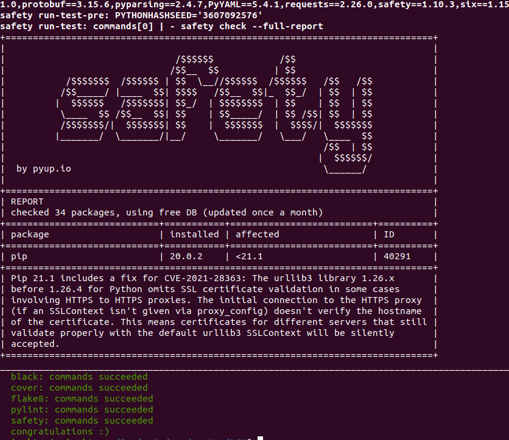

## [OSM Geliştirme - Ana sayfa](../README.md)

# Test edilmesi

Yapılan geliştirmenin doğruluğunu ve hatasız çalıştığını test etmek için birim testler geliştirilebilir veya bir geliştirme ortamında modülü yeniden inşa edilebilir.

## Birim test

Birim testler kodun doğruluğu ve geliştirmenin sağlığı açısından çok önemlidir. Daha önceden geliştirilmiş olan modül içerisinde yapılan değişikliklerin yapısının bozulup bozulmadığını en iyi şekilde bize gösterir. Birim testlerin geliştirilmesi sırasında yapılmış olabilecek hatanın giderilmesi sağlanabilir. Bu yüzden her geliştirilen fonksiyon için detaylıca birim testlerin yazılmış olması önemlidir.

OSM modülleri içerisinde `test` klasörü altında `test_isim.py` şeklinde birim testleri bulunmaktadır.

## Hata kontrolü

Her bir modülün içerisinde bir `tox.ini` dosyası bulunmaktadır. Bu sayede işiniz tamamlandığında hızlıca hata kontrolü sağlanabilmektedir. Kod gönderilmeden önce mutlaka bu komut bir kere çalıştırılmış olmalıdır.

```bash
# Modül klasörü içerisinde bu komutu çalıştırmanız yeterlidir.
tox
```
Ekran görüntüsünde görüldüğü gibi çıktı alırsanız, yapıtığınız değişiklik gönderilmeye hazırdır.



## Modülün yeniden inşa edilmesi

Geliştirmenin tamamlanmasıyla birlikte kod canlıya alındığında ön görülemeyen bir çok hata ile karşılaşılabilinmektedir. Bu yüzden geliştirme için test senaryolarıyla denenmesiyle bu hatalar temizlenebilir. Bu işlem içinde modülün tekrar inşa edilmesi gerekmektedir. 

Burada örnek olarak LCM modülünde yaptığınız bir değişiklik için kolayca Dokcer yanısının tekrar yapılandırılmasıyla bu işlem yapılabilir.

Öncelikle, Docker yanısının yeniden inşa edileceği makinaya geliştirme yaptığımız LCM modülünü kopyalanmalıdır. Koplayamayı gerçekleştirirken `.git`in gizlenmiş dosyalarında kopyalandığından emin olun.

Örnek kopyalama komutu:
```bash
ssh <user>:<host> 'mkdir -p ~/osm-modules/LCM'
# `!(venv)` ile venv klasörü kopyalanmaz.
scp -rp LCM/!(venv) <user>:<host>:/home/ubuntu/osm-modules/LCM
scp -rp LCM/.git* <>:<>:~/osm-modules/LCM
```

Güncel Docker yansıları devops modülünde bulunmaktadır.
```bash
git clone "https://osm.etsi.org/gerrit/osm/devops"
```

`devops` klasörü içerisinden `docker` klasörü açılır ve burada bütün modüllerin yansıları bulunmaktadır. Yansıyı incelerseniz OSM modüllerin kurulumları `deb` paketleri üzerinden gerçekleşmektedir.

```yaml
48 ARG PYTHON3_OSM_COMMON_URL
49 ARG PYTHON3_OSM_LCM_URL
50 ARG PYTHON3_N2VC_URL
51
52 RUN curl $PYTHON3_OSM_COMMON_URL -o osm_common.deb
53 RUN dpkg -i ./osm_common.deb
54
55 RUN curl $PYTHON3_OSM_LCM_URL -o osm_lcm.deb
56 RUN dpkg -i ./osm_lcm.deb
57
58 RUN curl $PYTHON3_N2VC_URL -o osm_n2vc.deb
59 RUN dpkg -i ./osm_n2vc.deb
```

Eğer `common` ve `N2VC` modüllerinde değişiklikler mevcut ise bu modüllerinde kopyalayın.

Bu örnek çalışma için common ve N2VC OSM repodan çekilerek kurulum yapılacak

```bash
# common
git clone "https://osm.etsi.org/gerrit/osm/common"
# N2VC
git clone "https://osm.etsi.org/gerrit/osm/N2VC"
```

Bundan sonraki komutlar tüm modüller içerisinde çalıştırılması gerekecek, bu modüllerin `deb` paketleri hazırlanması sağlanacaktır.

```bash
# Gereksiz dosyaları temizler. `git clone` ile indirilen modüller için çalıştırılmasına gerek yoktur.
git clean -dfx
# `deb` paketi hazırlanacak modüller için Docker yansısını hazırlayın. Paketleri container içerisinde gerçekleştirilecektir. Herhangi bir modül içerisinde bulunan Dockerfile dosyası kullanılabilir.
docker build -t osm-deb-package-builder LCM/.
```

`deb` pakletlerin depolanacağı bir klasör oluşturalım. 

```bash
mkdir deb-packages
```

Bütün bu oluşturulan ve kopyalanan dosyaların hepsi `osm-modules` klasöründe bulunmalı ve birazdan yapılacak tüm işlemler yine aynı klasörün içerisinden çalıştırılmalıdır.

Tüm modüllerin bulunduğu dosyayı bu konteynere bağlayarak çalıştırıp, paket kurulumlarını yapıcağımız ortamı başlatalım.

```bash
docker run -it --rm -v `pwd`:/package-build-folder -w /package-build-folder --entrypoint /bin/bash osm-deb-package-builder
```

Her modül içerisinde `devops-stages` klasörü bulunmaktadır. Buradan `stage-build.sh` kullanılarak paketler oluşturulur.

```bash
# deb paketi hazırlar. Her modül için yani LCM örneğinde common, N2VC içinde bu işlemler tekrarlanması gerekmektedir.
# LCM
pushd LCM && ./devops-stages/stage-build.sh && cp deb_dist/*.deb ../deb-packages/lcm.deb && popd
# N2VC
pushd N2VC && ./devops-stages/stage-build.sh && cp deb_dist/*.deb ../deb-packages/n2vc.deb && popd
# common
pushd common && ./devops-stages/stage-build.sh && cp deb_dist/*.deb ../deb-packages/common.deb && popd
# Az önceki işlemler yapılırken paketler `deb-packages` klasöründe toplanmış durumda olması gerekir. bir web sunucu başlatarak deb paketlerin bu sunucudan indirilmesi için LCM modülü inşa etme başlatılırken bu bağlantılar verilecektir.
pushd deb-packages && tmux new -d '/usr/bin/python3 -m http.server 8080' && popd
# İşlemler tamamlanınca tmux oturumunu durdurmak için, önce oturumun id numarasını bulup
tmux ls
# id numarasıyla bu komut ile durdurulabilir.
tmux kill-session -t <id>
```

LCM modülünün Docker yanısının tekrar inşa etmek için tüm gerekli paketler hazır durumdadır. Şimdi LCM modülünün yukarıda eklenen kısmı için gerekli bilgileri vererek yanının inşa edilmesini başlatabiliriz.

```bash
# LCM modülünün yeni imajının kurulumu aşağıdaki komut ile gerçekleştirilir.
# Eğer web sunucu ve Docker aynı makinada yer alıyorsa ip kısmı `localhost` olarak kalabilir.
export DOCKER_TAG=dev
docker build -t opensourcemano/lcm:${DOCKER_TAG} \
--build-arg PYTHON3_OSM_COMMON_URL=localhost:8080/common.deb \
--build-arg PYTHON3_N2VC_URL=localhost:8080/n2vc.deb \
--build-arg PYTHON3_OSM_LCM_URL=localhost:8080/lcm.deb \
devops/docker/LCM/.
```

Diğer modüller içinde aynı yöntem uygulanarak yeni yeni kurulumları gerçekleştirilebilir. Bundan sonraki adım ise bu yansıların K8s içerisinde yansı(image) isminin değiştirilerek Pod'un yeniden kurulması sağlanır ve artık mevcut OSM ortamında değişiklik yapılan LCM modülü çalışmaya hazırdır.

```bash
# Hızlı bir şekilde OSM K8s nesnelerine yansı bilgisini değiştirmek için komut örneği
kubectl -n osm patch deployment lcm --patch '{"spec": {"template": {"spec": {"containers": [{"name": "lcm", "image": "opensourcemano/lcm:'${DOCKER_TAG}'"}]}}}}'
# Eğer yansı ismi değişmeyecekse aşağıdaki komut ile yeniden Pod ayaklanması sağlanır.
kubectl -n osm scale deployment lcm --replicas=0
kubectl -n osm scale deployment lcm --replicas=1
```